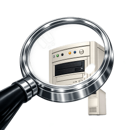
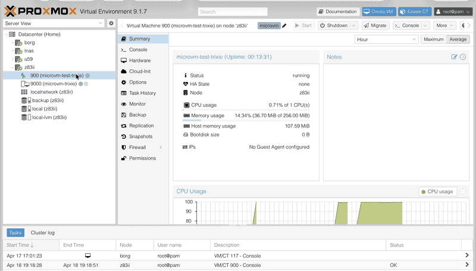

# pve-microvm



<p align="center">
  
</p>

A Debian package that adds QEMU `microvm` machine type support to Proxmox VE.
Runs OCI container images, [Firecracker rootfs images](docs/firecracker.md), unikernels, and alternative OS as lightweight hardware-isolated VMs.

> **⚠️ Highly experimental.** This project patches `qemu-server` internals and
> has not been tested in production. Use at your own risk. The patches are
> fully reversible — uninstalling the package restores the original files.

📝 [Blog post with some background](https://taoofmac.com/space/notes/2026/04/19/1400#proxmox-microvms) · ❓ [FAQ](docs/faq.md)

---

## Motivation

We needed something between LXC containers and full QEMU VMs for running
coding agents and other semi-trusted workloads.

| | LXC | microvm | Standard VM |
|---|---|---|---|
| Isolation | Namespace (shared kernel) | **KVM (own kernel)** | KVM (own kernel) |
| Boot time | ~50 ms | **< 200 ms** | 2–10 s |
| Overhead | Minimal | **Minimal** | Moderate |
| Attack surface | Broad (host kernel) | **Minimal (virtio-mmio)** | Broad (emulated PC) |
| Untrusted code | ⚠️ risky | **✅ safe** | ✅ safe |

**Hardware-isolated VMs with container-like speed**, managed through the same
Proxmox tools you already use. No new runtime — QEMU's `microvm` machine type
is already on every PVE node. This package just unlocks it.

## Prior art

As of April 2026, **nobody has done this** — no Proxmox patches, packages,
or integrations exist for the QEMU microvm machine type.

---

## Quick start

```bash
# Install
dpkg -i pve-microvm_0.3.0-1_all.deb

# Create a template from debian:trixie-slim (28 MB)
pve-microvm-template

# Clone and boot
qm clone 9000 901 --name my-sandbox --full
qm start 901
qm terminal 901

root@microvm:~#
```

Or manually:

```bash
qm create 900 --machine microvm --memory 256 --cores 1 \
  --name my-microvm --net0 virtio,bridge=vmbr0 \
  --serial0 socket --vga serial0

pve-oci-import --image alpine:latest --vmid 900 --configure

qm start 900
qm terminal 900
```

---

## What's included

| Component | Description |
|---|---|
| **`PVE::QemuServer::MicroVM`** | Perl module — microvm QEMU command generation |
| **`pve-microvm-patch`** | Safe apply/revert of qemu-server patches |
| **`pve-microvm-template`** | Create PVE templates from OCI images for instant cloning |
| **`pve-oci-import`** | Convert any OCI image to a bootable microvm disk |
| **`pve-microvm-share`** | Share host directories into guest via virtiofs |
| **`pve-microvm-ssh-agent`** | Forward host SSH agent into guest via vsock |
| **`pve-microvm-run`** | Run commands in ephemeral microvms (auto-cleanup) |
| **`pve-microvm-bench`** | Measure boot time and resource overhead |
| **`microvm-init`** | Minimal init for images without one (e.g., `debian:trixie-slim`) |
| **`vmlinuz-microvm`** | Pre-built 6.12.22 kernel with PCIe virtio + vsock + virtiofs |
| **Supported distros** | Debian, Ubuntu, Alpine, Fedora, Rocky, Alma, Amazon Linux |
| **Web UI extension** | `microvm` in machine dropdown, ⚡ icon, xterm.js serial console |

## Tested on

| Component | z83ii | borg |
|---|---|---|
| **CPU** | Intel Atom x5-Z8350 @ 1.44 GHz | Intel Core i7-12700 @ 4.9 GHz (20 cores) |
| **RAM** | 2 GB | 125 GB |
| **Proxmox VE** | 9.1.7 | 9.1.7 |
| **QEMU** | 10.1.2 | 10.1.2 |
| **Host kernel** | 6.17.13-2-pve | 6.17.13-2-pve |
| **Guest kernel** | 6.12.22 LTS | 6.12.22 LTS |
| **Storage** | LVM-thin | LVM-thin |

---

## Documentation

- **[Installation](docs/installation.md)** — install, verify, uninstall
- **[Usage Guide](docs/usage.md)** — templates, OCI import, console, networking, guest agent, virtiofs, vsock
- **[Configuration](docs/configuration.md)** — supported/unsupported options, example config
- **[Architecture](docs/architecture.md)** — how it works, QEMU command line, storage backends
- **[Kernel Guide](kernel/README.md)** — build config, defconfig base, PVE overlay
- **[Firecracker Compatibility](docs/firecracker.md)** — importing Firecracker rootfs images
- **[Test Matrix](docs/test-matrix.md)** — distros, features, and hardware tested
- **[Known Issues](docs/known-issues.md)** — agent timing, serial buffering, slow hardware
- **[Limitations](docs/limitations.md)** — what doesn't work (yet)
- **[Troubleshooting](docs/troubleshooting.md)** — common issues and fixes
- **[Development](docs/development.md)** — repo structure, building, testing, references

---

## Roadmap

### Shipped

- [x] `qm create/start/stop/destroy` with microvm
- [x] Serial console via `qm terminal` and PVE web UI (xterm.js)
- [x] OCI image import and template cloning
- [x] All PVE storage backends (LVM, LVM-thin, ZFS, Ceph, NFS)
- [x] Pre-built microvm kernel (6.12.22 from defconfig)
- [x] Web UI machine type dropdown
- [x] Balloon device for memory reporting
- [x] Guest agent (virtio-serial, auto-retry)
- [x] Networking (tap, bridge, VLAN, DHCP via cloud-init)
- [x] `microvm-init` for minimal OCI images
- [x] GitHub Actions CI/CD with kernel + initrd build
- [x] Cloud-init / user-data — SSH keys, hostname, network config
- [x] Linked clones — instant LVM snapshot cloning
- [x] dpkg trigger — auto-reapply patches on `qemu-server` upgrades
- [x] SSH agent forwarding via vsock (`pve-microvm-ssh-agent`)
- [x] vsock host↔guest sockets (CID = VMID + 1000)
- [x] virtiofs shared folders (`pve-microvm-share`)
- [x] Volume mounts via virtiofs
- [x] `qm shutdown` — graceful shutdown via guest agent
- [x] Disk resize (`qm disk resize`)
- [x] vzdump backup (stop-mode)
- [x] Offline migration between nodes (shared storage, 2s on CIFS)
- [x] HA support (ha-manager add/relocate, stop-migrate-start cycle)
- [x] OSv unikernel template (2.5 MB loader, boots on q35)
- [x] gokrazy appliance support (instructions for gok CLI)
- [x] Firecracker rootfs compatibility (direct ext4 import)
- [x] 13 Linux distros: Debian, Ubuntu, Alpine, Fedora, Rocky, Alma, Amazon, Oracle, UBI, Photon, Azure Linux
- [x] Snapshots (`qm snapshot`)
- [x] Firewall integration (tap on vmbr0)
- [x] Resource accounting (cluster resources)
- [x] `onboot` / startup order
- [x] Nested virtualization (KVM passthrough)
- [x] Suppress SeaBIOS (qboot auto-selected)
- [x] Alpine template support (apk-based chroot)
- [x] Template profiles (minimal/standard/full, --no-docker, --no-ssh, --no-agent)
- [x] [Plan 9 / 9Front](docs/limitations.md#9front--plan-9-experimental) template (experimental — non-Linux microvm proof-of-concept)
- [x] Performance benchmarking (`pve-microvm-bench`)
- [x] GUI: conditional panel hiding (wizard + hardware view)
- [x] GUI: one-click clone from microvm templates
- [x] GUI: microvm chip badge, info banners, options filtering
- [x] GUI: context menu serial console + clone shortcuts
- [x] GUI: custom icon persistence (CSS-based, purple ⚡ bolt)
- [x] GUI: wizard auto-config (serial, agent, 256MB memory)
- [x] GUI: dark mode support
- [x] systemd-networkd auto-enable
- [x] Guest agent device path fix

### Planned

| Feature | Priority | Impact | Effort |
|---|---|---|---|
| **Network off by default** — boot without network unless enabled | Medium | Medium | Low |
| **Egress allow-list** — restrict outbound to specific hosts | Medium | Medium | Medium |
| **9p filesystem sharing** — alternative to virtiofs | Low | Medium | Medium |
| **CPU/memory hotplug** — dynamic scaling | Low | Medium | Medium |
| **Multiple kernel management** — ship/manage versions | Low | Low | Low |
| **Custom icon persistence** — ⚡ across browsers | ✅ Done | ✅ Done | ✅ Done |
| **Declarative VM config** — Smolfile-style TOML | Low | Medium | Medium |
| **GPU passthrough** — virtio-gpu exploratory | Low | Medium | High |
| **AArch64 guest support** — ARM64 PVE hosts | Low | Medium | High |
| **Upstream proposal** — RFC for Proxmox pve-devel | Low | High | High |

---

## License

[Apache-2.0](LICENSE)
